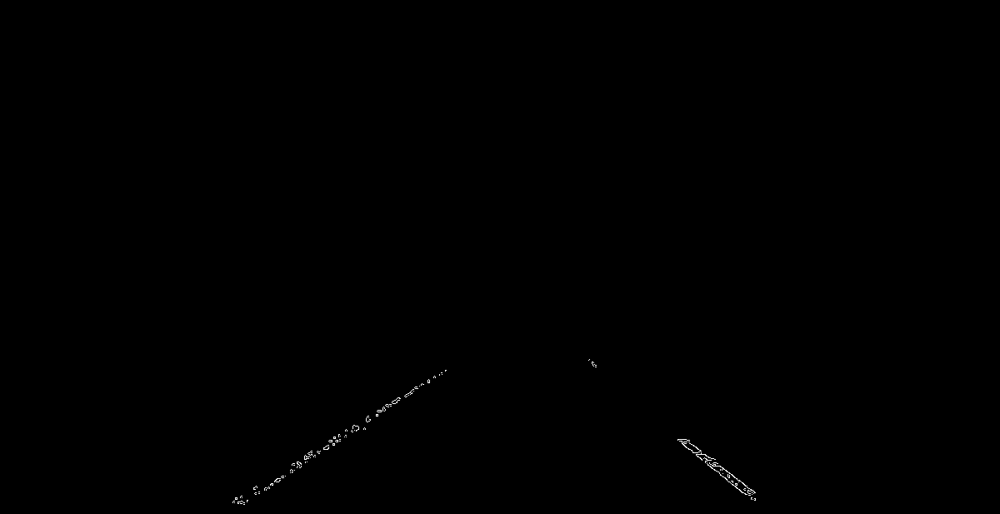
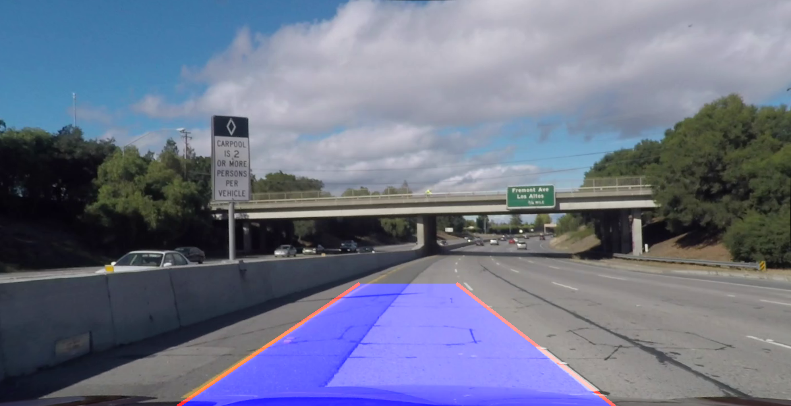
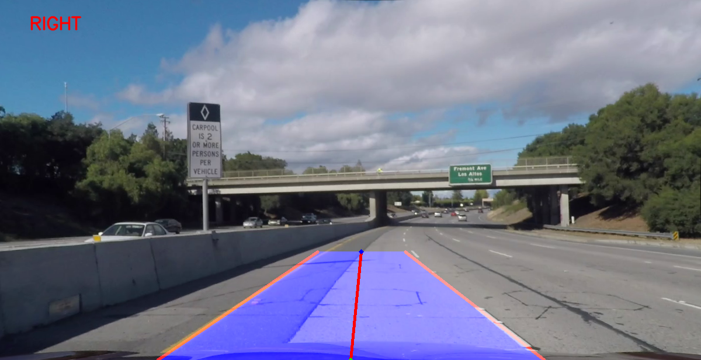

# Lane_Detection
This project outlines a simple algorithm to perform lane detection and turn prediction for a self driving car. This will attempt to replicate techniques used in lane departure and warning systems. The video used for this project can be found [here](https://github.com/llDev-Rootll/Lane_Detection/blob/master/data/challenge_video.mp4).

  
## Procedure
## Lane Detection
 - Each frame of the video is read sequentially
 - Each image is undistorted by using the camera matrix and the distortion coefficients provided [here](https://github.com/llDev-Rootll/Lane_Detection/blob/master/data/cam_params.yaml).
 - The lane lines in the video are of two colors, yellow and white, therefore extraction of both is important.
 - The image is converted to the HSV color space and a mask for the yellow line is generated by using the threshold values for yellow.
 - Next, the original image is converted to grayscale and aggressive thresholding is performed. Finally the mask with the yellow line is added to this image.
 - Canny edge detection is used to extract edges from this image.
 

  

 
 - A trapezoidal region of interest is then defined and the following operations are performed only withing this region of interest.
 - We then use probabilistic hough transform (ro=6, theta=3, threshold=35, minimum_line_length=40 and maximum_line_gap=150) to detect lines in the edge map.
 - Since this operation fits multiple lines for each edge we will now compute the optimal line for each left and right lane marker.
 - This is done by computing the average intercept and slope for all lines pertaining to the left and right lane marker respectively. The lines pertaining to these slopes and intercepts are considered to be the detected lane markers.
 - The center line of the lane is then computed by taking the average of the x and y co-ordinates of lane markers.
 - The OpenCV polyfill function is used to fill the lane on a blank image and a weighted sum of the lane mesh with the original image is used to overlay the lane mesh on the road.
 
 

  
 

 
 
 ## Turn Prediction
 
 - Turn prediction is achieved by using the center line of the lane. Since the the center of the road keeps shifting in the video, a static point of reference cannot be used to infer whether the car is veering to the left or the right.
 - Hence, the x co-ordinate of the bottom most point of the center line is used as the dynamic point of reference. 
 - The deviation of the top most point of the center line is used to determine whether the car is to turn left, right, or remain heading straight. Appropriate thresholds are set for the same.
 
 

  

  
 
 The final result is show below.
 
 

  

## Steps to run the program
Clone this repository and run the follow line in the terminal to run the lane detection and turn prediction algorithm for the given video. 

    cd ...<path_to_repository>/code/
    python3 lane_detect.py
